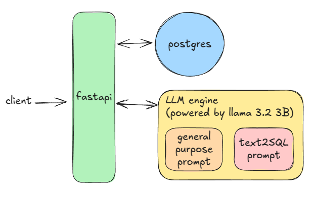

# how to run

1. clone the repo

```bash
git clone https://github.com/juanjofrelopez/llm-challenge.git
cd nivii-challenge/infra
```

2. launch the services

```bash
sudo docker compose up
```

3. upload csv file

```bash
curl -X POST -F "file=@<path_to_csv_file>" http://localhost:8000/upload-csv
```

# results

**POST** `/text2sql`

- body:

```json
{
  "prompt": "What is the most bought product on Fridays?"
}
```

- response:

```json
{
  "sql": "\nSELECT product_name, SUM(quantity) AS total_quantity\nFROM public.csv_entries\nWHERE week_day = 'Friday'\nGROUP BY product_name\nORDER BY total_quantity DESC\nLIMIT 1;\n"
}
```

**POST** `/nlp-query`

- body:

```json
{
  "prompt": "What is the most bought product on Fridays?"
}
```

- response:

```json
{
  "question": "What is the most bought product on Fridays?",
  "sql": "\nSELECT product_name, SUM(quantity) AS total_quantity\nFROM public.csv_entries\nWHERE week_day = 'Friday'\nGROUP BY product_name\nORDER BY total_quantity DESC\nLIMIT 1;\n",
  "result": "(Alfajor Sin Azucar Suelto, 850.0)",
  "humanized_result": "The most bought product on Fridays is Alfajor Sin Azucar Suelto, with a total of 850 units sold."
}
```

**POST** `/nlp-query`

- body:

```json
{
  "prompt": "which article was the most sold on any day?"
}
```

- response:

```json
{
  "question": "which article was the most sold on any day?",
  "sql": "\nSELECT \n    product_name, \n    date, \n    SUM(quantity) AS total_quantity\nFROM \n    public.csv_entries\nGROUP BY \n    product_name, date\nORDER BY \n    total_quantity DESC\nLIMIT 1;\n",
  "result": "(Alfajor Sin Azucar Suelto, 2024-10-03, 240.0)",
  "humanized_result": "The most sold article on any day was Alfajor Sin Azucar Suelto, which was sold on October 3, 2024, with a total of 240 units sold."
}
```

# architecture



# endpoints

- **POST** `/upload-csv`
  - body: file
  - response:
  ```JSON
  {
      "message": "Data uploaded successfully",
      "rows_processed": "<rows_processed>"
  }
  ```
- **POST** `/text2sql`
  - body:
  ```JSON
  {
      "prompt" : "<prompt>"
  }
  ```
  - response:
  ```JSON
  {
      "sql" : "<ai_generated_sql_query>"
  }
  ```
- **POST** `/nlp-query`
  - body:
  ```JSON
  {
      "prompt" : "<prompt>"
  }
  ```
  - response:
  ```JSON
  {
    "question": "question",
    "sql": "<ai_generated_sql_query>",
    "result": "<db_result>",
    "humanized_result": "<ai_generate_humanized_result>"
  }
  ```

# todo

- [x] launch a basic fastapi app
- [x] load csv to psql
- [x] expose api endpoint to load csv
- [x] launch llm engine in docker
- [x] custom prompt for text2sql engine
- [x] code text2sql functionality
